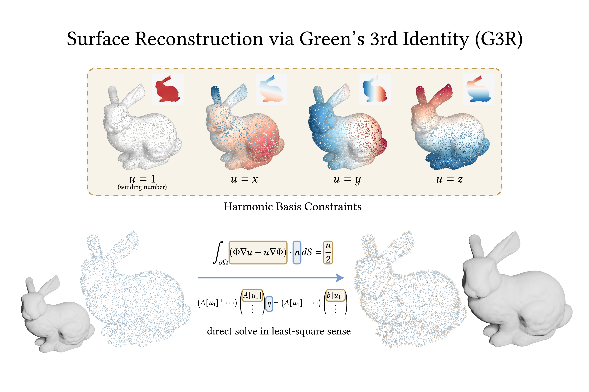

# Surface Reconstruction via Green's 3rd Identity (G3R)

This repository contains the official implementation of the paper:

**[Surface Reconstruction via Green's 3rd Identity](https://doi.org/10.1145/3799902.3811154)** (SIGGRAPH 2026 Conference Paper)

**[Zhonghao Wu](https://wuzhonghao.com/), [Dong Xiao](https://submanifold.github.io/), [Renjie Chen](http://staff.ustc.edu.cn/~renjiec/)**



## Quick Start

`toy_g3r.py` is a self-contained, single-file toy implementation for quickly trying out the algorithm. It explicitly constructs the full dense matrix and solves it directly, so it is only intended for small point clouds (<10,000 points).

```bash
python toy_g3r.py bunny.xyz
```

## Full Implementation

`main_g3r.py` loads a point cloud and solves the linear system derived from Green's 3rd Identity using iterative solvers. It is built on PyTorch and uses a C++/CUDA extension (`wn_treecode`) with octree acceleration.

### Setup

Make sure PyTorch and the CUDA toolkit are installed, then install the remaining dependencies and compile the extension:
```bash
pip install tqdm trimesh psutil
pip install -e ext --no-build-isolation
```

### Usage

Basic usage:
```bash
python main_g3r.py INPUT [options]
```

Example:
```bash
python main_g3r.py bunny.xyz \
    --epsilon 1e-3 \
    --test_funcs "poly(:2)" \
    --iter 10 sd 20 cg
```

### Arguments

| Argument | Description | Default |
|---|---|---|
| `INPUT` | Path to the input point cloud file. | *(required)* |
| `--epsilon` | Regularization parameter. | `1e-3` |
| `--test_funcs` | Test functions for evaluating reconstruction quality (see below). | `"poly(:2)"` |
| `--iter` | Number of iterations for each solver. | `10 sd 20 cg` |
| `--out_dir` | Output directory for results. | `./results` |
| `--cpu` | Run on CPU instead of GPU. | — |

**`--test_funcs` syntax.** Test functions are specified as regular solid harmonics with degree $l$ and order $m$:

- `"poly(:2)"` — $l$ from 0 to 2, all orders.
- `"poly(2:4)"` — $l$ from 2 to 4, all orders.
- `"poly(2, -1:1)"` — $l = 2$, $m$ from −1 to 1.
- `"poly(0); poly(2)"` — $l = 0$ and $l = 2$, all orders.

**`--iter` syntax.** Solvers and their iteration counts are specified as alternating number–name pairs:

- `sd` — steepest descent.
- `cg` — conjugate gradient.

For example, `--iter 10 sd 20 cg` runs 10 iterations of steepest descent followed by 20 iterations of conjugate gradient.